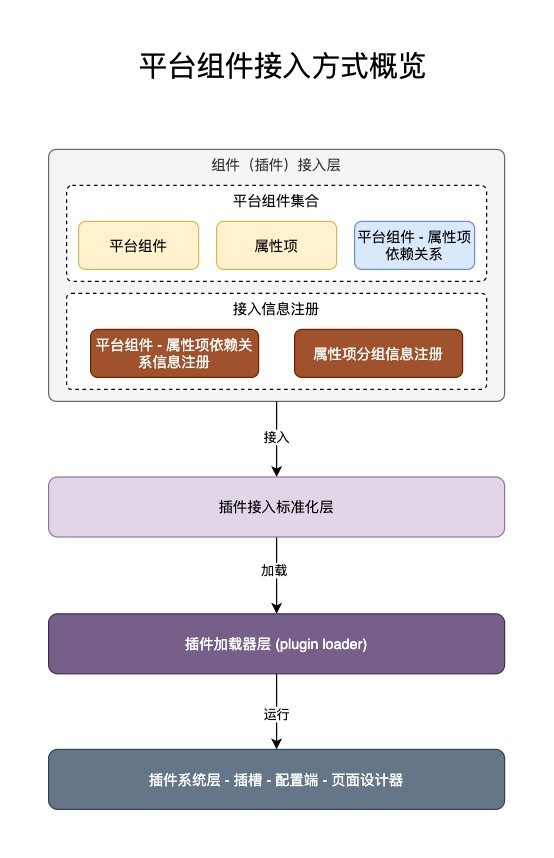
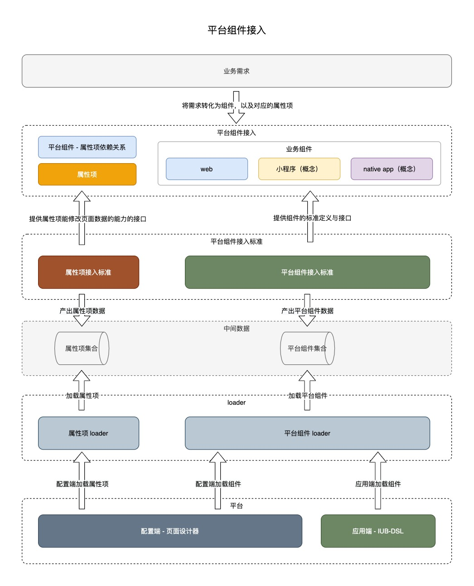
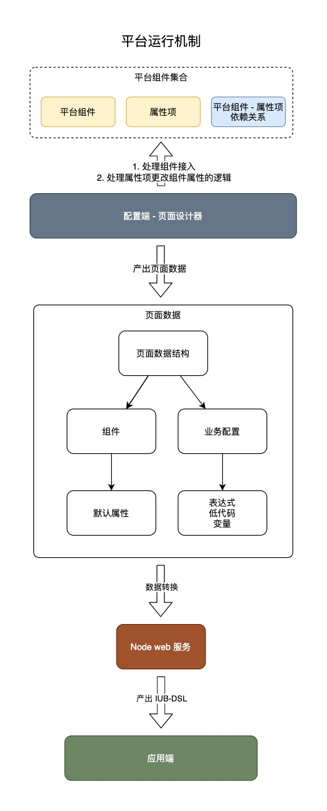

## 1. 平台对组件的影响

由于平台组件运行在两个环境，分别是 `配置端` 和 `应用端`，开发组件时需要结合实际业务，根据由外部传入的`平台上下文（组件运行环境，配置端或者应用端）`进行渲染和交互。

同时会受到以下方面的影响：

### 1.1. 样式框架影响

接入平台的组件将运行在平台之中，所以也将会收到平台的样式框架的影响，以下为样式框架的依赖：

1. [`tailwind.css`](https://tailwindcss.com/docs/flex-direction) 最基本的样式框架，不依赖任何组件，作为平台基本的样式支持
   1. TODO 样式命名规范
2. `antd` 以后考虑替换方案替换该 UI 库
3. `deer-ui` 以后考虑替换方案替换该 UI 库

### 1.2. UI 框架影响

1. 平台提供基础的 UI 隔离架构 `@infra/ui`，其中包含通用的基础组件可以选择
2. 可以由接入的自身决定使用什么 UI 框架，在可控的范围内放开技术选型，后续再做技术收敛

## 2. 平台提供的能力

页面设计器主要是提供两个核心功能：

1. 提供一份描述页面布局、业务逻辑的数据结构
2. 提供更改页面数据结构的 API

## 3. 平台组件接入图解

平台组件接入概览

平台组件接入流程，TODO 跟代码结合

平台组件的运作机制

