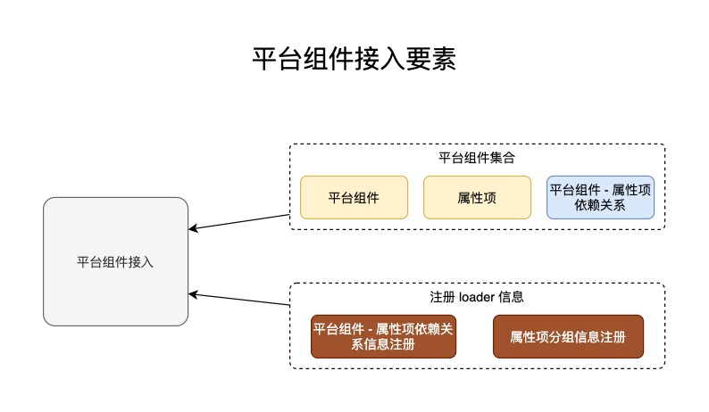

## 1. 前期知识

如果还未学习接入前准备，请看这篇文章：[平台组件接入知识准备](access_platform_widget_lib)

---

## 2. Changelog

| 作者 | 更新日期 | 版本 | 更改内容 |
|---|---|---|---|
| 相杰 | 2020-11-16 | v1.0.0 | 初稿 |
| 相杰 | 2020-11-29 | v1.1.0 | 1. 完善平台组件接入的描述<br />2. 添加对于页面数据的描述<br /> |
| 相杰 | 2020-11-30 | v1.1.1 | 1. 完善文档描述 |
| 相杰 | 2020-11-30 | v1.1.2 | 1. 添加 API 说明<br />2. 将文档切割 |

---

## 3. 编写目的和范围

1. 平台组件的渐进式接入指南
   1. 接入普通业务组件和属性项

---

## 4. 术语

| 术语 | 解释 |
|---|---|
| 平台 | 指整个平台，从配置到应用的全链路 |
| 平台组件 | 接入平台的组件，包括`业务组件、属性项、组件-属性项依赖关系`，__只需要接入一次__，即可在配置端和应用端使用 |
| 平台组件集合 | 包括`平台组件、属性项、组件-属性项依赖关系`，接入平台后可运行的最小单位 |
| 属性项 | 只在接入配置工具，工作范围是修改选中的组件的属性，以及更改页面元数据 |
| 平台组件-属性项的依赖关系 | 指平台组件在接入到配置端中，依赖了多少个属性项 |
| 平台组件资源加载器 loader | 用于平台加载组件或属性项的加载器 |

---

## 5. 平台组件接入要素



## 6. 工程目录

目前阶段需要将整个自定义 3.0 前端工程 clone 到本地。

### 6.1. 组件接入的工作目录

- `packages/`
  - `platform-widget-hub` 平台组件开发的工作区。
  - `platform-widget-prop-item-hub` 属性项开发的工作区，
  - `platform-widget-access-prop-rely` 平台组件与属性项的依赖关系，
  - `platform-widget-access-loader` 平台组件资源加载器，用于加载组件数据。

### 6.2. 组件接入的扩展目录

- `packages/`
  - `platform-widget-custom-editor-hub` 自定义的平台组件的属性编辑器，当遇到难以扩展的属性项编辑时，预留扩展的。

---

## 7. 平台组件 & 属性项的接入步骤概览

1. 平台组件接入
   1. 创建平台组件工程
   2. 定义组件的元数据描述
   3. 创建组件 (widget)
2. 属性项接入
   1. 创建属性项工程
   2. 定义属性项元数据描述
   3. 编写属性项编辑的业务逻辑
3. 建立平台组件 - 属性项的关联关系
4. 将平台组件和属性项注册到对外提供的服务接口
   1. 在属性项分组信息中注册属性项引用
   2. 将组件和属性依赖关系注册到 loader 获取服务中
5. 检查是否接入成功
   1. 启动必要服务
      1. 在本地启动配置前端（[参考](/docs/introduction)）
      2. 在本地启动应用前端，参考同上
      3. 在本地启动 platform-web-server，参考同上
   2. 打开配置前端，如果没有其他，打开 [http://localhost:6679/](http://localhost:6679/)
      1. 选择一个应用（如果没有现成应用，则需要创建应用。这里假设已经存在应用。）。
      2. 编辑其中的一个页面（如果没有现成页面，则需要创建页面。这里假设已经存在页面。）。
      3. 在左侧的「控件类型」面板查看是否存在接入的组件，如果有，则拖动进入中间的画布区域。
      4. 点击右上方的「预览」按钮，查看应用端是否正常显示。
   3. 如果上述步骤没有问题，则表示接入成功。否则，需要进一步排查错误。
6. 接入异常排查
   1. TODO

> 准备就绪，即将开始

---

## 8. 平台组件接入

组件无法修改页面数据，只负责纯粹渲染和用户交互。

### 8.1. 创建平台组件工程

工作目录： `packages/platform-widget-hub`。__未来在基础框架成熟后，将在单独的工程中开发平台组件。__

我们将平台组件当成一个完整的工程来看待，以下是平台组件工程目录结构：

- `packages/platform-widget-hub`
  - `{xxx组件目录名}` 名字根据实际的业务组件的功能来取
    1. `package.json` 描述平台组件工程的文件
    2. `spec.tsx` 接入规格，定义组件的元数据、可编辑属性等
    3. `index.ts` 索引文件
    4. `{其他}.tsx` 可以编写任意的组件，由 `spec.tsx` 调用

以下我们以 `单行输入框 FormInput` 为例子：

`package.json`

```json
{
  "name": "@platform-widget/form-input",
  "description": "表单单行输入框",
  "version": "0.0.1",
  "author": "xxx",
  "license": "MIT",
  "dependencies": {}
}
```

### 8.2. 定义组件的元数据描述

参考：[packages/platform-widget-hub/FormInput/spec.tsx](https://10.0.4.55/custom-platform-v3-frontend-group/custom-platform-v3-frontend/tree/dev/packages/platform-widget-hub/FormInput/spec.tsx)。

我们将基于装饰器（decorator）的方式来定义并约束平台组件：

`spec.tsx`

```tsx
import React from 'react';
import {
  PlatformWidget, PlatformWidgetComp,
  WidgetEntityState, WidgetActions
} from '@platform-widget-access/spec';
import { FormInputComp } from './comp';

@PlatformWidget({
  title: 'FormInput',
  // 定义可被编辑的属性
  editableProps: {
    title: {
      type: "string"
    },
    labelColor: {
      type: "string"
    },
    realVal: {
      type: "string"
    },
  }
})
export class FormInput implements PlatformWidgetComp {
  constructor(widgetMeta) {
    console.log(widgetMeta);
  }

  printA() {
    console.log('A');
  }

  render(widgetState: WidgetEntityState, widgetActions: WidgetActions) {
    return (
      <FormInputComp {...widgetState} {...widgetActions} />
    );
  }
}
```

#### 8.2.1. API

```ts
import {
  PlatformWidget, PlatformWidgetComp,
  WidgetEntityState, WidgetActions
} from '@platform-widget-access/spec';
```

| API | 说明 | 输入类型 | 默认值 |
|--|--|--|--|
| `PlatformWidget` | 构造平台组件的函数 | PlatformWidgetMeta | {} |
| `PlatformWidgetComp` | 平台组件要实现的类，必须实现其中的 `render` 函数 |  | {} |
| `WidgetEntityState` | 平台组件实例状态，`render` 的回调传入的第一个参数 |  | {} |
| `WidgetActions` | 平台组件实例交互的 `action` ，`render` 的回调传入的第二个参数 |  | {} |

### 8.3. 创建组件 (widget)

需要熟悉 `react` 的组件编写方，可以根据实际情况，将 `comp.tsx` 中的组件切割为多个组件：

`comp.tsx`

```tsx
/**
 * 在 form 表单中有标题的 Input 组件
 */
import React from 'react';
import { Input } from 'antd';

/**
 * FormInput 必须的 props
 */
export interface FormInputCompProps {
  title: string
  /** 默认值 */
  realVal: string
  labelColor: string
}

export const FormInputComp: React.FC<FormInputCompProps> = (props) => {
  const {
    title,
    labelColor,
    realVal,
  } = props;

  return (
    <div>
      <div
        style={{
          color: labelColor
        }}
      >
        {title}
      </div>
      <Input value={realVal} style={{ width: 300 }} />
    </div>
  );
};
```

添加索引文件 `index.ts`：

```ts
export * from './spec.tsx'
```

---

## 9. 属性项接入

工作目录： `packages/platform-widget-prop-item-hub`。

> 属性项的最主要功能是修改页面数据

### 9.1. 编辑页面数据的能力范围

1. 属性项只能编辑 __被选中的组件实例的状态__ 。
2. 属性项可以编辑页面元数据（`pageMetadata`）

### 9.2. 创建属性项工程

参考：[packages/platform-widget-prop-item-hub/TitleHelper/spec.tsx](https://10.0.4.55/custom-platform-v3-frontend-group/custom-platform-v3-frontend/tree/dev/packages/platform-widget-prop-item-hub/TitleHelper/spec.tsx)。__点击进入查看 ts 定义，有更详细的注释。__

同样的，我们将属性项也当成一个完整的工程来看待，以下是属性项工程包含的文件：

- `packages/platform-widget-prop-item-hub`
  - `{yyy属性项目录名}` 名字根据实际的属性项的功能来取
    1. `package.json` 描述属性项工程的文件
    2. `spec.tsx` 接入规格，定义属性项的元数据、将要编辑的属性等
    3. `index.ts` 索引文件
    4. `{其他}.tsx` 可以编写任意的组件，由 `spec.tsx` 调用

### 9.3. 定义属性项元数据描述

以下以`标题 Title`为例：

`package.json`

```json
{
  "name": "@platform-widget-prop-item/title-helper",
  "description": "标题属性编辑",
  "version": "0.0.1",
  "author": "xxx",
  "license": "MIT",
  "dependencies": {}
}
```

### 9.4. 定义属性项元数据描述

`spec.tsx`

```tsx
import React, { useEffect } from 'react';
import { PropItem, PropItemRenderContext } from '@platform-widget-access/spec';
import { TitleEditorComp } from './comp';

@PropItem({
  id: 'prop_title_value',
  title: 'PropTitle',
  label: '标题',
  // 将要编辑的属性的 keys，将通过 PropItemRenderContext.editingWidgetState 传入
  whichAttr: ['title', 'field'],
  defaultValues: {
    title: '标题'
  },
})
export class TitleHelperSpec {
  render(ctx: PropItemRenderContext) {
    const { takeMeta, changeWidgetType } = ctx.platformCtx.meta;
    return (
      <TitleEditorComp {...ctx} takeMeta={takeMeta} />
    );
  }
}
```

#### 9.4.1. API

| API | 说明 | 输入类型 | 默认值 |
|--|--|--|--|
| PropItem | 构造属性项的函数，属性项必须实现 `render` 接口 |  | {} |
| PropItem.whichAttr | 属性项能修改的组件属性的范围，将在属性项 `render` 中传入 |  | {} |
| PropItem.useMeta | 属性项能修改的页面元数据的范围，将在属性项 `render` 中传入 |  | {} |
| PropItemRenderContext | 由配置端传入，用于修改页面数据、组件实例状态、调用页面设计器提供的 UI 能力 |  | {} |

### 9.5. 编写属性项编辑的业务逻辑

`comp.tsx`

```tsx
import React, { useEffect } from 'react';
import { Input } from '@infra/ui';
import { PropItemRenderContext } from '@platform-widget-access/spec';

export const TitleEditorComp: React.FC<PropItemRenderContext> = ({
  changeEntityState,
  editingWidgetState,
  platformCtx: {
    meta: {
      takeMeta
    }
  }
}) => {
  const { title, field } = editingWidgetState;
  const selectedField = takeMeta({
    metaAttr: 'schema',
    metaRefID: field
  });
  useEffect(() => {
    const nextTitle = selectedField?.column?.name;
    if (!nextTitle || nextTitle === title) return;
    changeEntityState({
      attr: 'title',
      value: nextTitle
    });
  }, [field]);
  return (
    <div>
      <Input
        value={title || ''}
        onChange={(value) => changeEntityState({
          attr: 'title',
          value
        })}
      />
    </div>
  );
};
```

创建索引文件 index.ts。

```tsx
export * from './spec';
```

---

## 10. 建立平台组件 - 属性项的关联关系

工作目录： `packages/platform-widget-access-prop-rely`。

参考：[packages/platform-widget-access-prop-rely/rely-meta/FormInput-meta.ts](https://10.0.4.55/custom-platform-v3-frontend-group/custom-platform-v3-frontend/tree/dev/packages/platform-widget-access-prop-rely/rely-meta/FormInput-meta.ts)

```tsx
import { CreateWidgetPropItemRely } from "@platform-widget-access/spec";

export const DropdownSelectorMeta = CreateWidgetPropItemRely({
  id: 'widget-id-5',
  label: '下拉选择器',
  widgetRef: 'DropdownSelector',
  // 指定组件的分组信息，如果没有分组，则默认分到「未分组」中
  wGroupType: 'formController',
  propItemsRely: {
    propItemRefs: [
      { propID: 'prop_widget_coding' },
      { propID: 'prop_datasource_selector' },
      { propID: 'prop_style_title_color' },
      {
        propID: 'prop_title_value',
        defaultValues: {
          title: '下拉选择'
        },
      },
      { propID: 'prop_field' },
      // { propID: 'prop_flex_config' },
    ]
  }
});
```

---

## 11. 将平台组件和属性项注册到对外提供的服务接口

工作目录： `packages/platform-widget-access-loader`。

### 11.1. 注册到组件 `loader`

`platform-widget-access-loader/refs-widget.ts`

```ts
export * from '@platform-widget-prop-item/{xxx组件目录名}';
```

### 11.2. 注册到属性项 `loader`

`platform-widget-access-loader/refs-prop-item.ts`

```ts
export * from '@platform-widget-prop-item/{yyy属性项目录名}';
```

### 11.3. 在属性项分组信息中注册属性项引用

`packages/platform-widget-access-loader/services/prop-grouping.ts`

```ts
export const propItemGroupingData: GroupPanelData[] = [
  {
    title: '属性',
    itemsGroups: [
      {
        title: '基本属性',
        items: [
        ]
      },
      {
        title: '状态属性',
        items: [
        ]
      },
      {
        title: '数字属性',
        items: [
        ]
      },
      {
        title: '控件校验',
        items: [
        ]
      },
    ]
  },
  {
    title: '样式',
    itemsGroups: [
      {
        title: '样式属性',
        items: [
        ]
      },
    ]
  },
  {
    title: '数据',
    itemsGroups: [
      {
        title: '控件校验',
        items: [
        ]
      },
    ]
  },
];
```

### 11.4. 将组件和属性依赖关系注册到 loader 获取服务中

编辑 `packages/platform-widget-access-loader/services/get-widget-rely-meta.ts`

```ts
import {
  Widget, // 从这里导入
} from "@platform-widget-access/prop-item-rely";

const tempArr = [
  Widget // 从这里导出
];
```
